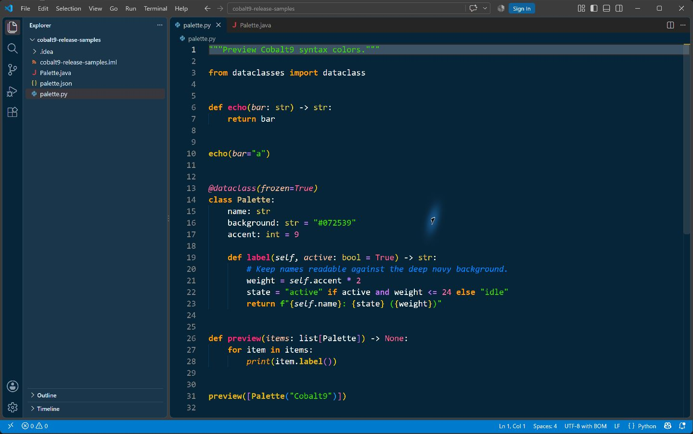
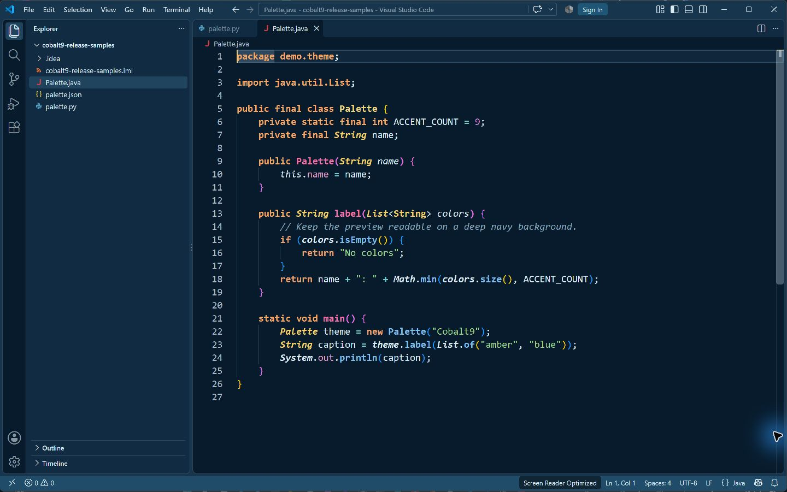

# Cobalt9 Theme

A theme by pydemia that keeps the original Cobalt9 colors. A few existing
colors distinguish declarations from references and calls.

## Screenshots

| Role | Color |
| --- | --- |
| Background | `#072539` |
| Text | `#FFFFFF` |
| Comments | `#0088FF` |
| Statements and control keywords | `#FF9D00` |
| Storage and declaration modifiers | `#FF9D00` |
| Class declarations | `#D7BA7D` |
| Type references | `#E5CA48` |
| Function declarations | `#F92672` |
| Function calls | `#E2B40D` |
| Built-in functions | `#FF9D00` |
| Variables and instance names | `#FFFFFF` |
| Parameters | `#FFFFFF` |
| Python parameter declarations and keyword argument names | `#FFC4A3` |
| Properties | `#FFFFFF` |
| Strings | `#3AD900` |
| Numbers | `#FB71A3` |
| Built-in constants | `#FF628C` |
| Operators | `#BA76E9` |
